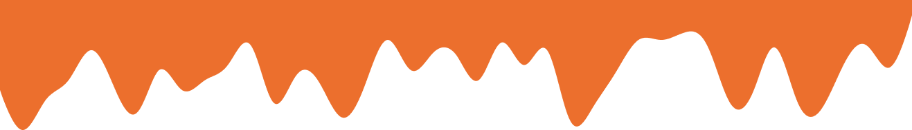

### Hi there, I'm RACHIDI Achraf 👋

## I'm a Software Engineer Student at EILCO , Developer and i focus on Web Dev technologies

- 🌱 I’m currently working on a project with LARAVEL 😏

### Connect with me:

[][linkedin]

 

## :zap: 42 Profile Card

 

## :zap: Github Stats 

 

## :zap: Most Used Languages

## :zap: Some Languages and Tools:

   

<!-- Identifiers -->
[linkedin]: https://www.linkedin.com/in/achraf-rachidi-01b6141b0

